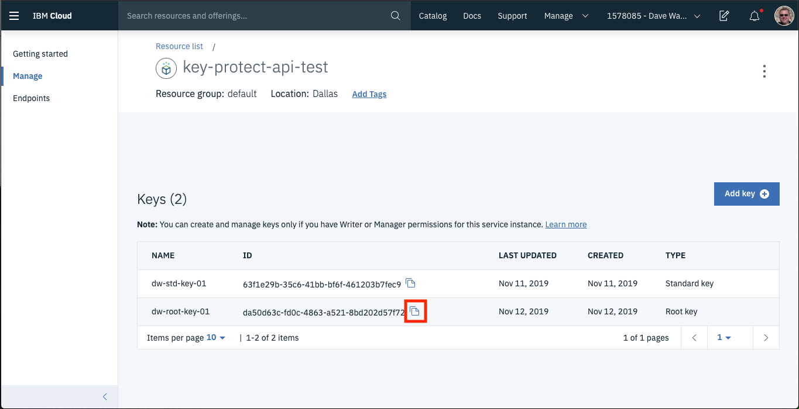

# key-protect-samples

This repo contains a basic set of sample APIs that show how you can wrap and unwrap a Data Encryption Key (DEK) with a root key in IBM Key Protect.  A data encryption key can be any value that is less than 4096 bytes in length.  In this example, rather than wrapping a data encryption key that was used to encrypt some other data we will simply wrap some field that contains sensitive data.  

This project is written in node.js, so you will need to have `node` and `npm` installed on your machine. 

To get started, simply clone this repo to your local machine, then change directories into the root directory for this repo in a shell or terminal window.  NOTE: These instructions have only been tested on a Mac.

Run `npm install` to install the dependencies.

To interact with the <a href="https://cloud.ibm.com/apidocs/key-protect" target="_blank">IBM Key Protect API</a> you need two key items:

- The GUID of an instance of IBM Key Protect in your <a href="https://cloud.ibm.com" target="_blank">IBM Cloud</a> account. You can use the `ibmcloud` <a href="https://cloud.ibm.com/docs/cli?topic=cloud-cli-install-ibmcloud-cli" target="_blank">cli</a> to find this value. 
- a valid API key for a user or service id in your account that has access to the Key Protect Instance.  If you do not have one you can create one <a href="https://cloud.ibm.com/iam/apikeys" target="_blank">here</a>.

To find the guid for your Key Protect instance, login to the `ibmcloud` cli:

`ibmcloud login`

Run this command to see all of your services:

`ibmcloud resource service-instances`

When you find your Key Protect instance, run this command:

`ibmcloud resource service-instance <your key protect instance name>`

It should return something like this:
```
Retrieving service instance key-protect-api-test in all resource groups under account Dave Wakeman's Account as dwakeman@us.ibm.com...
OK
                          
Name:                  key-protect-api-test   
ID:                    crn:v1:bluemix:public:kms:us-south:a/<data not shown>
GUID:                  a67fe553-630b-<data not shown>   
Location:              us-south   
Service Name:          kms   
Service Plan Name:     tiered-pricing   
Resource Group Name:   default   
State:                 active   
Type:                  service_instance   
Sub Type:              kms   
Created at:            2019-11-11T15:12:14Z   
Created by:            dwakeman@us.ibm.com   
Updated at:            2019-11-11T15:12:14Z   

``

You will need to set two environment variables in the terminal window where you will be running this application:

`export KEY_PROTECT_INSTANCE=<your instance GUID>`
`export IBM_API_KEY=<your API Key>`

You will also need to create a root key in your Key Protect instance.  You will need the ID of the root key.  To get the ID, click on the copy button to the right of your key id:




