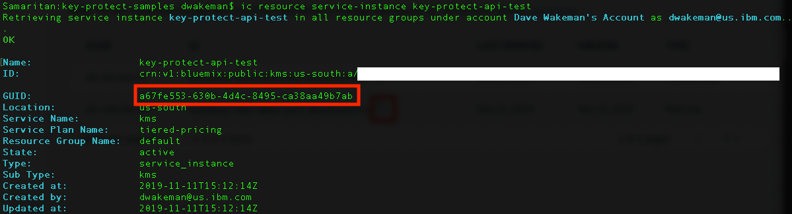

# key-protect-samples

This repo contains a basic set of sample APIs that show how you can wrap and unwrap a Data Encryption Key (DEK) with a root key in IBM Key Protect.  A data encryption key can be any value that is less than 4096 bytes in length.  In this example, rather than wrapping a data encryption key that was used to encrypt some other data we will simply wrap some field that contains sensitive data.  

This project is written in node.js, so you will need to have `node` and `npm` installed on your machine. 

To get started, simply clone this repo to your local machine, then change directories into the root directory for this repo in a shell or terminal window.  NOTE: These instructions have only been tested on a Mac.

Run `npm install` to install the dependencies.

To interact with the <a href="https://cloud.ibm.com/apidocs/key-protect" target="_blank">IBM Key Protect API</a> you need two key items:

- The GUID of an instance of IBM Key Protect in your <a href="https://cloud.ibm.com" target="_blank">IBM Cloud</a> account. You can use the `ibmcloud` <a href="https://cloud.ibm.com/docs/cli?topic=cloud-cli-install-ibmcloud-cli" target="_blank">cli</a> to find this value. 
- a valid API key for a user or service id in your account that has access to the Key Protect Instance.  If you do not have one you can create one <a href="https://cloud.ibm.com/iam/apikeys" target="_blank">here</a>.

To find the guid for your Key Protect instance, login to the `ibmcloud` cli:

`ibmcloud login`

Run this command to see all of your services:

`ibmcloud resource service-instances`

When you find your Key Protect instance, run this command:

`ibmcloud resource service-instance <your key protect instance name>`

It should return something like this:


You will need to set two environment variables in the terminal window where you will be running this application:

`export KEY_PROTECT_INSTANCE=<your instance GUID>`

`export IBM_API_KEY=<your API Key>`

Once you have set the two environment variables in the terminal, run this command to start the app:

`npm start`

The output will look like this:


You will also need to create a root key in your Key Protect instance.  You will need the ID of the root key.  To get the ID, click on the copy button to the right of your key id:


Now the application is running in a terminal window, but we need a way to test it.  Open up a new terminal window where you will run some `curl` commands.

The first test will be to encrypt some sensitive data.  For this example, the body of the request has some JSON which includes a field called `ssn`.  This is the field we want to encrypt.  To tell the sample code to use this field, you will specify a special http header that it looks for, called `sensitive-data`.  You can see that header in the command below.

```
curl -X POST http://localhost:3000/encrypt/<Your root key id> -H 'Content-Type: application/json' -H 'sensitive-data: ssn' -d '{"name": "John Smith", "email": "john@acme.com", "ssn": "21365987"}'
```

Copy the command above and paste into the new terminal window you just opened.  Be sure to replace the `<your root key id>` with your own root key id.

It should produce a result like this:


The output from the command is enclosed in the red box.  It's a bit hard to read here, but it worked!  If you were to use another tool, such as Postman, to test the API the output data would look more friendly.


Now that you have encrypted the sensitive data you need to be able to decrypt it!  The call do to so is very similar to the previous request.  In fact, for it to work you need to pass as input to the decrypt call the exact same output you got form the encrypt call.

_**Note:** The JSON in the `-d` parameter below is the output from the command above.  You should NOT use the value below!!  Rather, replace it with the output from your command._


To run the second test to decrypt the data, copy and paste the command below into your terminal window.  Be sure to replace the `<your root key id>` with your own root key id.  Also, replace the JSON in the `-d` parameter with the output from your command.  The `ssn` field here was encrypted using a root key in MY instance of Key Protect; your value will be different!!

```
curl -X POST http://localhost:3000/decrypt/<your root key id> -H 'Content-Type: application/json' -H 'sensitive-data: ssn' -d '{"name":"John Smith","email":"john@acme.com","ssn":"eyJjaXBoZXJ0ZXh0IjoicVN1ODZranFKdytuUFZIYkRjb1VwVk9wbms0PSIsIml2IjoiY0p2S1FLMzF1VnA0MVJnbCIsInZlcnNpb24iOiI0LjAuMCIsImhhbmRsZSI6ImRhNTBkNjNjLWZkMGMtNDg2My1hNTIxLThiZDIwMmQ1N2Y3MiJ9"}'
```
The picture below shows the result of both commands using `curl`:


Here is the more friendly view from Postman:


That's it!  You have just encrypted some data by wrapping it with a root key from Key Protect, and then unwrapped it to get back the original data.


